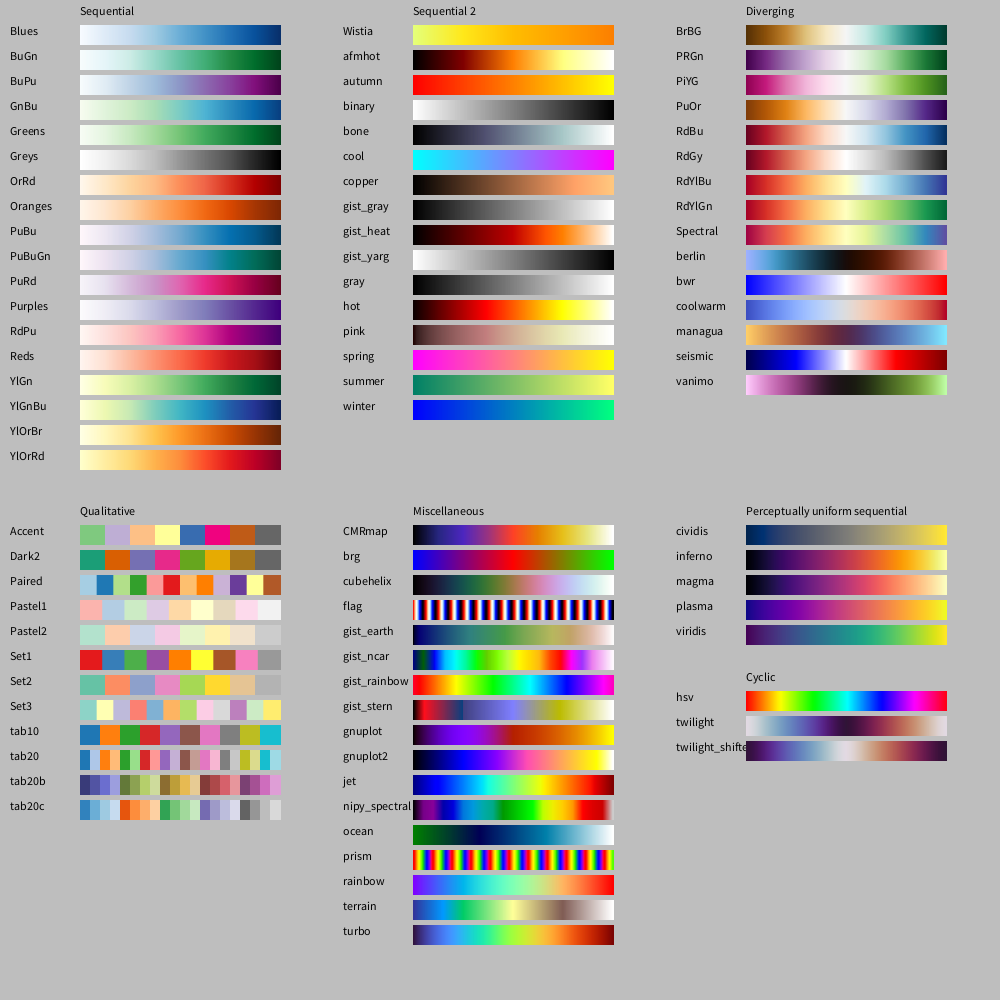

# ColorMaps from matplotlib

## Purpose

The goal of this project is to provide a Processing library containing the color maps from Python's matplotlib.

Colormaps convert numerical values into colors. They are widely used to display measurements or statistical data in a way that's easy for humans to understand, but they are also extremely useful for creating beautiful, computed pictures.

Creating effective and aesthetically pleasing colormaps is a difficult task. Fortunately, many have already invested significant effort into this and have published their work in the public domain. The [colormaps included in Python's matplotlib](https://matplotlib.org/stable/gallery/color/colormap_reference.html) are a great example of this.

## Basic Usage

    // Import the library
    import de.kompf.colormapsmpl.*;

    // Instantiate the colormap registry
    ColorMapRegistry creg = new ColorMapRegistry();

    // Register colormap categories
    creg.registerCategorySequential();

    // Retrieve a color map by its name
    ColorMap cmap = creg.getColorMap("Blues");

    // Retrieve and use the colors
    int color = cmap.getColor(0);
    fill(color);

## Installation and reference

See detailed [documentation](https://skaringa.github.io/colormaps-mpl/).

## Examples

1. [ColorMapsReference](./examples/ColorMapsReference/ColorMapsReference.pde)
2. [Circles](./examples/Circles/Circles.pde)
